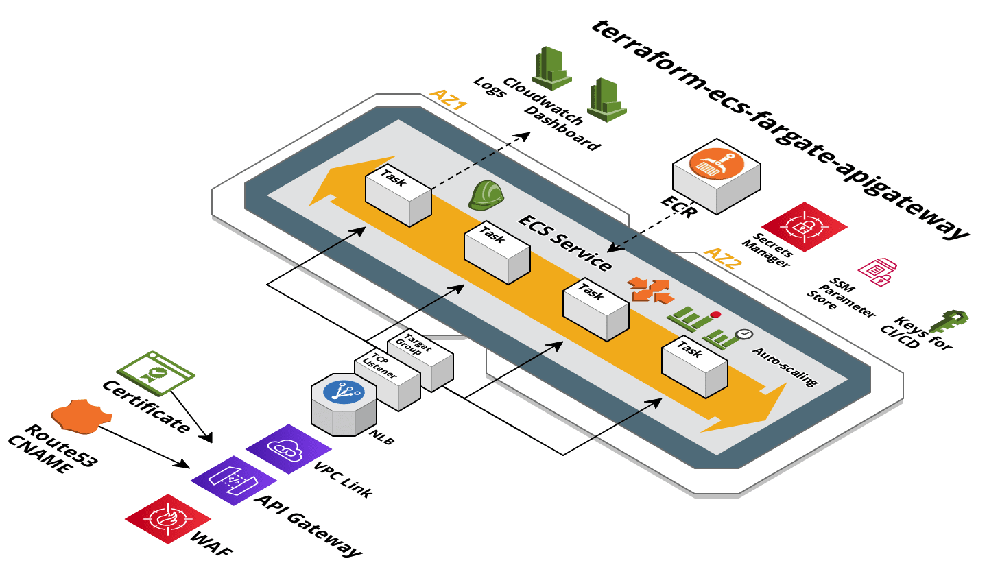

# Terraform ECS Fargate API Gateway

A Terraform template for provisioning API stacks on [AWS ECS Fargate](https://aws.amazon.com/fargate/) fronted by API Gateway and NLB.



The templates are designed to be customized.  The optional components can be removed by simply deleting the `.tf` file.

The templates are used for managing infrastructure concerns and, as such, the templates deploy a [default backend docker image](env/dev/ecs.tf#L52).  We recommend using the [fargate CLI](https://github.com/turnerlabs/fargate) for managing application concerns like deploying your actual application images and environment variables on top of this infrastructure.  The fargate CLI can be used to deploy applications from your laptop or in CI/CD pipelines.

## fargate-create

We recommend using the [fargate-create CLI](https://github.com/turnerlabs/fargate-create) to scaffold new projects based on this template.  `fargate-create` will download this template, update it based on environment, and add files that make it easy to test your app locally and then deploy to the cloud using [fargate CLI](https://github.com/turnerlabs/fargate).

install
```shell
curl -s get-fargate-create.turnerlabs.io | sh
```

create an input vars file (`fargate-create.tfvars`)
```hcl
# app/env to scaffold
app = "my-app"
environment = "dev"

container_port = "8080"
replicas = "1"
region = "us-east-1"
aws_profile = "default"
saml_role = "admin"
domain = "api.app.example.com"
zone = "app.example.com"
vpc = "vpc-123"
private_subnets = "subnet-123,subnet-456"
secrets_saml_users = []
tags = {
  application   = "my-app"
  environment   = "dev"
  team          = "my-team"
  customer      = "my-customer"
  contact-email = "me@example.com"
}
```

```shell
$ fargate-create -f fargate-create.tfvars -t git@github.com:turnerlabs/terraform-ecs-fargate-apigateway
```

The template can also be used standalone without fargate-create.


## Components

### base

These components are shared by all environments.

| Name | Description | Optional |
|------|-------------|:---:|
| [main.tf](./base/main.tf) | AWS provider, output |  |
| [state.tf](./base/state.tf) | S3 bucket backend for storing Terraform remote state  |  |
| [ecr.tf](./base/ecr.tf) | ECR repository for application (all environments share)  |  ||
| [dns.tf](./base/dns.tf) | Route53 zone for DNS (all environments share)  | Yes | | 

### env/dev

These components are for a specific environment. There should be a corresponding directory for each environment
that is needed.

| Name | Description | Optional |
|------|-------------|:----:|
| [main.tf](./env/main.tf) | Terrform remote state, AWS provider, output |  |
| [api-gateway.tf](./env/api-gateway.tf) | Regional API Gateway proxy |  |
| [api-usage-plans.tf](./env/api-usage-plans.tf) | API Gateway Usage Plan | Yes |
| [autoscale-perf.tf](./env/autoscale-perf.tf) | Performance-based auto scaling | Yes |
| [autoscale-time.tf](./env/autoscale-time.tf) | Time-based auto scaling | Yes |
| [cert.tf](./env/cert.tf) | ACM Certificate to enable HTTPS (with auto-validation) | |
| [cicd.tf](./env/cicd.tf) | IAM user that can be used by CI/CD systems | Yes |
| [dns.tf](./env/dns.tf) | Registers a custom domain name for use with AWS API Gateway | |
| [dashboard.tf](./env/dashboard.tf) | CloudWatch dashboard: CPU, memory, and HTTP-related metrics | Yes |
| [ecs.tf](./env/ecs.tf) | ECS Cluster, Service, Task Definition, ecsTaskExecutionRole, CloudWatch Log Group |  |
| [ecs-event-stream.tf](./env/ecs.tf) | Cloudwatch dashboard for ECS events | yes |
| [logs-logzio.tf](./env/logs-logzio.tf) | Ship container logs to logz.io | Yes |
| [nlb.tf](./env/nlb.tf) | NLB, Target Group, Listener  |  |
| [nsg.tf](./env/nsg.tf)| NSG for NLB and Task |  |
| [role.tf](./env/role.tf) | Application Role for container |  |
| [secretsmanager.tf](./env/secretsmanager.tf) | Add a Secrets Manager secret with a CMK KMS key. Also gives app role and ECS task definition role access to read secrets from Secrets Manager | Yes |
| [ssm-parameters.tf](./env/ssm-parameters.tf) | Add a CMK KMS key for use with SSM Parameter Store. Also gives ECS task definition role access to read secrets from parameter store. | Yes |
| [waf.tf](./env/waf.tf) |  WAF Regional Web ACL | Yes |


## Usage

Typically, the base Terraform will only need to be run once, and then should only
need changes very infrequently. After the base is built, each environment can be built.

```
# Move into the base directory
$ cd base

# Sets up Terraform to run
$ terraform init

# Executes the Terraform run
$ terraform apply

# Now, move into the dev environment
$ cd ../env/dev

# Sets up Terraform to run
$ terraform init

# Executes the Terraform run
$ terraform apply
```

##### Important (after initial `terraform apply`)

The generated base `.tfstate` is not stored in the remote state S3 bucket. Ensure the base `.tfstate` is checked into your infrastructure repo. The default Terraform `.gitignore` [generated by GitHub](https://github.com/github/gitignore/blob/master/Terraform.gitignore) will ignore all `.tfstate` files; you'll need to modify this!


## Additional Information

+ [Base README](./base/)

+ [Environment `dev` README](./env/dev)
